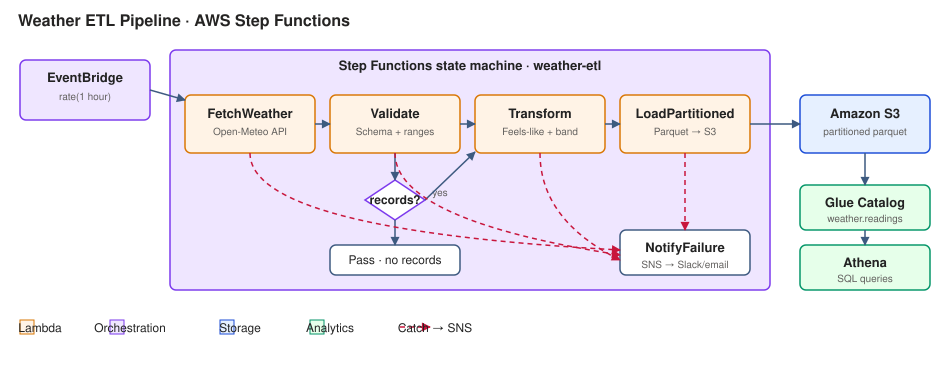

# Weather ETL Pipeline · AWS Step Functions + Lambda + S3 + Athena

Hourly serverless ETL that fetches current weather for 10 cities,
validates and enriches it, and lands partitioned Parquet in S3 that is
queryable through Athena.



## Why Step Functions

The pipeline has 4 stages that must each retry with backoff, one
choice branch (skip the load if there are no valid records), and a
single failure sink that pages on-call. Wiring that in Lambda code
means DIY retry state and error propagation; Step Functions gives it
declaratively in `statemachine/pipeline.asl.json`.

## Components

| Component | AWS resource | Job |
|---|---|---|
| `FetchWeatherFn`   | Lambda (Python 3.12) | Call Open-Meteo for 10 cities |
| `ValidateFn`       | Lambda | Schema + range checks; drop bad rows |
| `TransformFn`      | Lambda | Derive `feels_like_c` + `comfort_band` |
| `LoadPartitionedFn`| Lambda | Write Parquet to S3 partitioned by `year/month/day` |
| `NotifyFailureFn`  | Lambda | Publish failure to SNS (Slack/email fan-out) |
| `WeatherPipeline`  | Step Functions | Orchestration, retries, choice, catches |
| `DataBucket`       | S3 | `raw/` (Glacier after 90d) and `curated/` (Parquet) |
| `WeatherDatabase`  | Glue Catalog | Backs Athena reads over the partitioned table |
| `HourlySchedule`   | EventBridge | `rate(1 hour)` trigger |

## Repo layout

```
aws_pipeline/
├── template.yaml                 # SAM template
├── statemachine/
│   └── pipeline.asl.json         # Step Functions definition
├── lambdas/
│   ├── fetch_weather.py
│   ├── validate.py
│   ├── transform.py
│   ├── load_partitioned.py
│   └── notify_failure.py
├── tests/
│   ├── test_lambdas.py           # 4 unit tests
│   └── run_tests.py              # zero-dep runner (no pytest needed)
├── local_run.py                  # runs the whole state machine locally
├── athena_queries.sql            # 4 example queries with window functions
├── architecture.svg
└── README.md
```

## Run the pipeline locally (no AWS)

`local_run.py` interprets the ASL JSON and invokes every Lambda handler
in-process, so the full state machine (retries, choice, catch)
executes without deploying anything. The fetch Lambda falls back to
deterministic mock data when the Open-Meteo call is blocked, so the
pipeline still produces real records that flow through validate →
transform → load.

```bash
python3 local_run.py
```

Sample output:

```
── FetchWeather   (Task)   -> {"run_id": "..."}
── Validate       (Task)   -> {"valid_count": 10}
── HasRecords?    (Choice) -> Transform
── Transform      (Task)   -> {"records": 10}
── LoadPartitioned(Task)   -> {"loaded": 10,
                                "s3_uri": "curated/readings/year=2026/month=09/day=29/readings_...parquet"}
```

## Run the tests

```bash
python3 tests/run_tests.py
# 4 passed, 0 failed  (4 total)
```

## Deploy to AWS

```bash
sam build
sam deploy --stack-name weather-etl-dev \
           --parameter-overrides Environment=dev \
                                 DataBucketName=weather-etl-data-oviya \
           --capabilities CAPABILITY_IAM --resolve-s3

# Confirm the schedule
aws events list-rules --name-prefix weather-etl-hourly-dev

# Kick a one-off execution
aws stepfunctions start-execution \
   --state-machine-arn $(aws cloudformation describe-stacks \
        --stack-name weather-etl-dev \
        --query "Stacks[0].Outputs[?OutputKey=='StateMachineArn'].OutputValue" \
        --output text)
```

## Athena queries

Four analytical queries with window functions are in
`athena_queries.sql`: latest reading per city, daily min/avg/max, 3-hour
rolling temperature, and comfort-band share. They rely on partition
pruning to keep scans cheap.

## Cost note

At 24 executions/day × 4 Lambdas × ~300 ms each, the pipeline sits
inside the AWS Lambda free tier. S3 storage is bounded by the 90-day
Glacier transition on `raw/`.

## Tech

Python 3.12 · AWS SAM · Step Functions · Lambda · S3 · Glue · Athena · EventBridge · SNS
